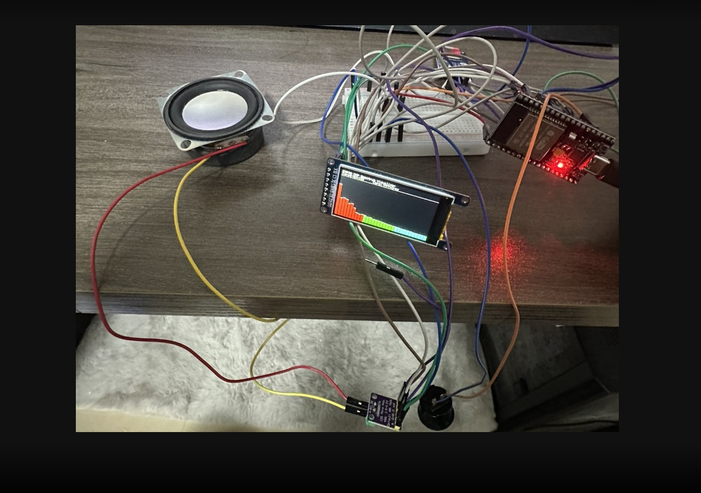

# ESP32 Dual-Core Audio Spectrum Visualizer

A professional, high-performance real-time audio visualizer utilizing the ESP32. This project solves the common stuttering and lag issues in audio playback by implementing a strict dual-core FreeRTOS architecture, hardware SPI isolation, and a custom lock-free ring buffer.

---

## System Showcase

### 1. Real-time Audio Visualizer
The ST7789 SPI LCD displays a fluid, 32-band audio spectrum perfectly synced with the music read from the SD card.
*(Note: You can replace this placeholder with a photo or GIF of the running device)*

---

## Architecture

We used a **Dual-core** setup here. Core 0 handles the high-priority I/O tasks like reading the SD card and continuously feeding the I2S audio amplifier, while Core 1 performs the heavy DSP (Fast Fourier Transform) and graphical rendering. This keeps the audio playing smoothly without any interruptions.

### 1. Dual-Core Task Management

### 2. Memory Allocation & Optimization

---

## Key Features

*   **No more lagging**: Thanks to the FreeRTOS dual-core setup and our custom **Lock-Free Ring Buffer**, the audio stream never stutters, avoiding latency caused by traditional Mutex context switching.
*   **Hardware Bus Isolation**: The ST7789 screen and the SD card are physically separated onto the `VSPI` and `HSPI` buses, totally eliminating bandwidth contention.
*   **Delta Rendering**: Instead of clearing the entire screen every frame, we calculate the exact difference and update only the modified bars. This slashes the SPI data overhead by over 90% and unlocks ultra-smooth frame rates.
*   **Psychoacoustic Mapping**: Tailored for human hearing, shedding useless high-frequency bins and applying a logarithmic gain algorithm to the visualization, resulting in a much more dynamic and immersive UX.

---

## Hardware & Environment
*   **Dev Env**: PlatformIO (Arduino Framework)
*   **Hardware**: ESP32 Dual-core (ESP32-WROOM/WROVER), MAX98357A I2S Amplifier, ST7789 SPI Display, MicroSD Card Module, Arcade Button (Hardware Interrupt).

---
*Created by [chen870527](https://github.com/chen870527)*
